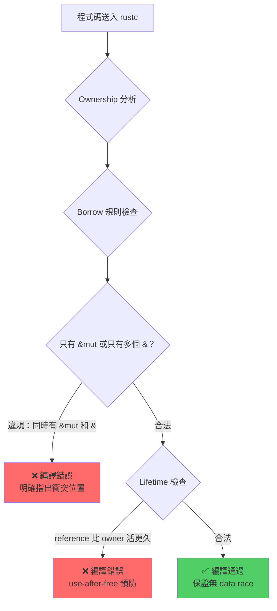

## 🔍 Explainer — Borrow Checker 深度解說


***

### 第一層｜🌍 大眾版類比

想像有一份重要的合約文件（記憶體資料）：

- **Rust 的規則**：同一時間，**要麼很多人可以「讀」，要麼只有一個人能「寫」，但不能同時又讀又寫**。這條規則在「印出合約前」（compile time）就強制檢查，違規直接拒絕印出。
- **Kotlin 的規則**：沒有這條強制規定。多人同時讀寫是被允許的，**衝突要等到合約真正被使用時**（runtime）才會發現文字被亂改了。

Rust 讓 **「規則違反」變成編譯錯誤**，而不是程式崩潰。[^1]

***

### 第二層｜🔬 專業版：Borrow Checker 的三條鐵律

Data race 的定義：**兩個以上的執行緒同時存取同一記憶體位置，且至少一個是寫入，且沒有同步機制**。[^2]

Rust 的 borrow checker 用以下三條規則，在 compile time **從結構上消滅** data race：[^3][^1]


| 規則 | 內容 | 防止的問題 |
| :-- | :-- | :-- |
| **Rule 1：唯一可變** | 同一作用域內，同一資料只能有 **一個** `&mut`（mutable reference） | 消滅 mutable aliasing，防止多處同時寫入 |
| **Rule 2：共享不可變** | 同一作用域內，可有 **多個** `&`（immutable reference），但此時不得有 `&mut` | 確保讀取期間沒有人在寫，不會讀到「半途資料」 |
| **Rule 3：Lifetime 界定** | 所有 reference 的存活時間不得超過資料本身的擁有者（owner） | 消滅 use-after-free 和 dangling pointer |

#### 📌 為什麼這三條規則就能消滅 Data Race？

Data race 的發生條件是：**「有人在寫」的同時「有人在讀或寫」**。Rule 1 + Rule 2 合起來，從語言層面保證這種狀態**在靜態分析時就不可能存在**：

```rust
fn main() {
    let mut data = vec![1, 2, 3];

    let r1 = &data;      // ✅ immutable borrow
    let r2 = &data;      // ✅ 多個 immutable borrow 可以共存
    // let w = &mut data; // ❌ 編譯錯誤！r1, r2 還活著，不能同時有 &mut
    
    println!("{:?} {:?}", r1, r2);
    // r1, r2 在這裡結束生命週期
    
    let w = &mut data;   // ✅ 現在可以了，因為 r1, r2 已結束
}
```

這不是「執行期檢查」，是 rustc 的靜態分析，**沒有任何 runtime overhead**。[^4][^5]

***

### 第三層｜⚖️ Kotlin 本質上做不到嗎？

**直接回答：是的，Kotlin 在語言設計層面，本質上就無法做到 compile-time 級別的 data race 防禦。** 原因分析如下：

#### 🔴 根本原因：設計哲學不同

| 面向 | Rust | Kotlin |
| :-- | :-- | :-- |
| **記憶體模型** | Ownership + Borrow（靜態追蹤） | GC / Reference Counting（動態追蹤） |
| **並發安全保證** | Compile-time 型別系統強制 | Runtime 工具（atomics、mutex、confinement） |
| **可變性控制** | 語言核心機制（`&` vs `&mut`） | `val` / `var` 區分，但無 aliasing 限制 |
| **Data race 發現時機** | 編譯失敗 ❌ | 執行崩潰或資料損壞 💥 |

#### 🔴 Kotlin 的本質障礙：無法追蹤 Aliasing

Kotlin 的 GC 設計允許同一個物件被多個變數同時持有（aliasing）。例如：

```kotlin
// Kotlin：這段程式碼完全合法，但可能造成 data race
val data = mutableListOf(1, 2, 3)
val alias1 = data   // ← 兩個 reference 指向同一個 list
val alias2 = data

// Thread A 和 Thread B 同時操作 alias1 和 alias2
// Kotlin 編譯器無法知道它們是同一個物件 → runtime 才會爆
```

要避免這個問題，Kotlin 開發者必須**手動**使用 `Mutex`、`Atomic`、`limitedParallelism`、Actor 等工具 ，這完全依賴**開發者的紀律**，而不是語言強制。[^6][^7]

#### 🟡 Kotlin 能補強嗎？

理論上，Kotlin 可以透過以下方式部分改善，但都有根本限制：


| 方案 | 可行性 | 限制 |
| :-- | :-- | :-- |
| 加入 borrow checker（類 Rust） | ⚠️ 極難 | 需要完全重新設計型別系統，與現有 GC 生態不相容 |
| 靜態分析工具（linter 層） | ✅ 部分可行 | 只能偵測簡單模式，無法做到 Rust 級別的完整保證 |
| `@Immutable` 注解 + 編譯器外掛 | ✅ 有限可行 | 無法追蹤複雜的 aliasing 鏈 |
| Kotlin/Native 的記憶體模型改進 | ✅ 已進行 | 仍依賴開發者自律，非語言強制 [^7] |


***

### 🗺️ 結構圖解（Borrow Checker 運作流程）




***

<span style="display:none">[^10][^11][^12][^13][^14][^15][^8][^9]</span>

<div align="center">⁂</div>

[^1]: https://trippy.dev/blogs/programming/rusts-borrow-checker-and-its-role-in-preventing-data-races

[^2]: https://jmmv.dev/2018/06/rust-review-borrow-checker.html

[^3]: https://blog.logrocket.com/introducing-rust-borrow-checker/

[^4]: https://www.youtube.com/watch?v=hmefR4tE_H4

[^5]: https://reintech.io/blog/understanding-implementing-rust-borrow-checker

[^6]: https://www.linkedin.com/posts/daveleeds_how-to-prevent-race-conditions-in-kotlin-activity-7398743882827706368-2ksW

[^7]: https://typealias.com/articles/prevent-race-conditions-in-coroutines/

[^8]: https://www.reddit.com/r/rust/comments/v3vagi/data_races_explanation_in_the_rust_book/

[^9]: https://rainingcomputers.blog/dist/the_intuition_behind_rusts_borrowing_rules_and_ownership.md

[^10]: https://users.rust-lang.org/t/for-beginners-an-interesting-article-about-ownership-and-borrowing/108718

[^11]: https://www.youtube.com/watch?v=Ap-cVIM5ORY

[^12]: https://discuss.kotlinlang.org/t/kotlin-coroutines-and-race-detection/2405

[^13]: https://news.ycombinator.com/item?id=46154386

[^14]: https://stackoverflow.com/questions/20374281/are-data-races-bad

[^15]: https://news.ycombinator.com/item?id=31723727

