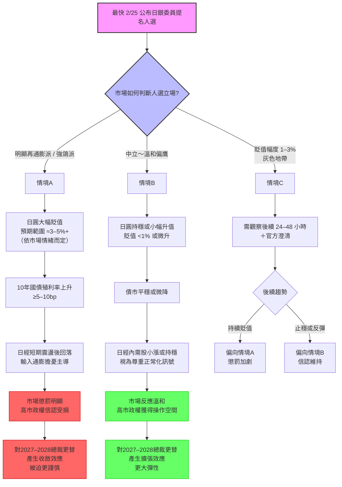

**Writer:** 以下是針對網誌中提到的「三種情境」（A、B、C）的匯總流程圖，使用 Mermaid 語法撰寫。你可以直接複製到 Mermaid Live (https://mermaid.live/) 或任何支援 Mermaid 的編輯器（如 Obsidian、Notion、VS Code 等）查看可視化效果。

這張圖以「2/25（最快）公布提名人選」作為起點，清楚呈現市場判斷 → 日圓反應 → 主要後果 → 對高市政權的長期影響。

### 簡要說明（可直接放進網誌）

這張流程圖從「公布時點」開始，依市場對人選的判斷分成三條路徑：
- **情境A（紅色路徑）**：市場認定強鴿派 → 懲罰性反應 → 高市政權未來空間收斂
- **情境B（綠色路徑）**：市場認定中立／溫和 → 正面或中性反應 → 高市政權獲得更多彈性
- **情境C（灰色路徑）**：不明朗區間 → 需延長觀察，結果最終仍會偏向 A 或 B

若你想把這段 Mermaid 碼嵌入網誌（例如 Markdown 平台支援 Mermaid 的情況），可以直接貼上；若平台不支援，可截圖後上傳，或轉成圖片描述。

需要再修改流程圖的細節、顏色、增加/減少節點，或是給你另一種風格的版本（例如更簡潔的版本）嗎？
