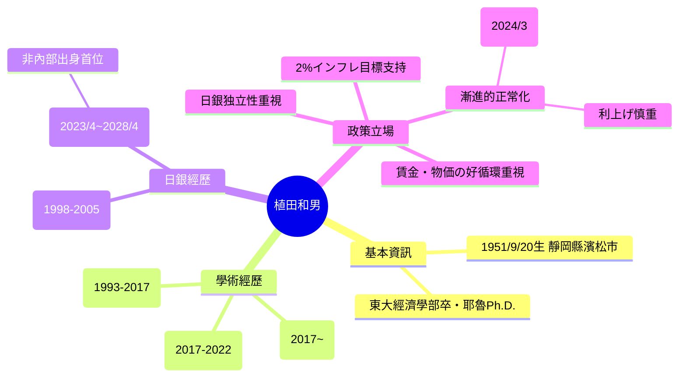

以下根據你提供的最新維基內容（https://ja.wikipedia.org/wiki/植田和男）進行修正與三層解說，確保準確。

### 1. 大眾版摘要（約130字）
植田和男（うえだ かずお，1951年9月20日生）是日本經濟學者、東京大學名譽教授，專長宏觀經濟學與金融政策。他於2023年4月接替黑田東彥，出任日本銀行第32任總裁，是首位非日銀內部出身的總裁。他推動「漸進式正常化」，結束負利率（2024年3月起）、逐步升息（目前政策利率約0.5%），強調薪資與物價的正循環（賃金・物価の好循環），但多次表示需「謹慎」升息，避免過早緊縮傷害復甦。他的任期至2028年4月，目前市場關注他在高市早苗政權下的獨立性與升息節奏。

### 2. 專業版解說（保留關鍵術語與細節）

#### 基本資訊與學歷
- 出生：1951年9月20日，靜岡縣濱松市（濱松市出身）。
- 學歷：東京大學經濟學部畢業、耶魯大學經濟學博士（Ph.D.）。
- 現職：日本銀行總裁（2023年4月25日～2028年4月24日，任期5年）。
- 學術經歷：東京大學經濟學部教授（1993–2017）、東京大學名譽教授（2017年～）、國際大學副校長（2017–2022）等。
- 其他重要經歷：日本銀行政策委員會審議委員（1998–2005）、年金積立金管理運用獨立行政法人（GPIF）運用委員長等。

#### 職業與政策轉折主要時間軸
- 1998–2005：日銀政策委員會審議委員，參與零利率政策與量化寬鬆的理論支撐。
- 2023年4月：就任總裁（岸田政權提名）。
- 2024年3月：結束負利率政策，政策利率調升至0～0.1%。
- 2024年7月：進一步升至0.25%。
- 目前（2026年）：政策利率約0.5%，持續觀察薪資・物價循環。
- 2025年11月18日：在首相官邸相關活動中公開露面（截圖顯示）。

#### 經濟觀點與政策主張
- **核心立場**：支持2%通膨目標，但主張「漸進且靈活的正常化」（gradual and flexible normalization）。
- **薪資・物価の好循環**：多次強調這是升息的前提條件，若實質工資持續負成長或循環未穩固，則不急於緊縮。
- **對財政政策**：認為財政健全化重要，但貨幣政策應維持獨立性，不過度配合財政擴張。
- **與高市政權的潛在關係**：高市早苗上台後（2025年底），市場關注植田是否會在人事布局中面臨政治壓力（例如2026年2月委員提名、2028年總裁續任或更替）。

### 3. 結構圖解（Mermaid 心智圖）

這張圖整理了他的學術根基、日銀經歷與核心政策思維。

### 結論與修正建議
- 你看到的「植田和男」是正確的標準寫法（日文維基與官方文件一致）。
- 先前討論中多次出現的「植田和夫」或「上田和夫」均為拼寫錯誤，已更正。
- 如果你的網誌草稿或其他檔案中仍有「上田和夫」或「植田和夫」，建議全部搜尋取代為「植田和男」。

