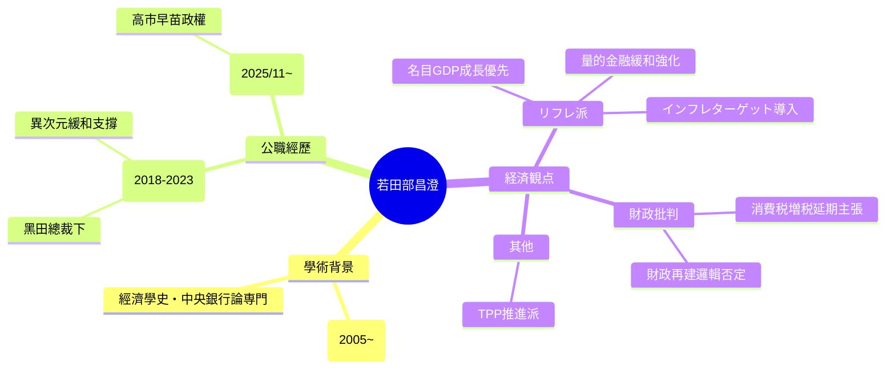

**Explainer:** 以下針對你提供的維基百科頁面（https://ja.wikipedia.org/wiki/若田部昌澄，最新內容反映至2025年底）進行三層解說。這是若田部昌澄（Masazumi Wakatabe）的日文維基百科條目，內容客觀、基於公開來源，聚焦他的學術與公職經歷。

### 1. 大眾版摘要（約130字）
若田部昌澄是日本知名經濟學者，早稻田大學教授，專長經濟學史與中央銀行理論。他是「再通膨派」（リフレ派）的代表人物，從1990年代起就主張日本央行要大力實施量化寬鬆（量的金融緩和）、設定通膨目標，來對抗長期通縮、促進名目經濟成長。2018–2023年曾擔任日本銀行（日銀）副總裁，協助黑田東彥總裁推動「異次元寬鬆」。2025年11月，高市早苗首相上台後，他被任命為政府「經濟財政諮詢會議」的民間委員。這讓他成為高市政權中少數具備日銀實務經驗的再通膨派聲音，市場關注他是否會影響未來貨幣政策方向。

### 2. 專業版解說（保留關鍵術語與細節）

#### 基本資訊與學歷
- 出生：1965年2月26日，神奈川縣出身。
- 學歷：早稻田大學政治經濟學部經濟學科（1987年畢業）、早稻田大學大学院經濟學研究科修士、トロント大學經濟學博士課程修了（1994年獲經濟學修士）。
- 現職：早稻田大學政治經濟學術院教授（2005年至今），曾任早稻田大學大学院經濟學研究科長。

#### 職業生涯主要時間軸
- 1987–2005：早稻田大學助手 → 助教授 → 教授。
- 期間客座：劍橋大學、喬治梅森大學、哥倫比亞大學研究員。
- 2018年3月20日–2023年3月19日：**日本銀行副總裁**（由安倍政權提名，黑田東彥總裁時代，支撐異次元寬鬆政策）。
- 2023年3月20日：辭去副總裁，復歸早稻田大學教授。
- 2025年11月：**經濟財政諮詢會議民間委員**（高市早苗政權下任命，與永浜利広、南場智子等一同入閣）。

#### 經濟觀點與主張
- **核心立場**：堅定リフレ派（再通膨派），主張強化量的金融緩和（量的金融緩和政策）、導入インフレターゲット（通膨目標），以提升名目GDP成長率解決貧困、財政壓力等問題。
- **對財政政策**：批判財政再建（財政再建）邏輯，認為財政緊縮易引發不況；主張延期消費稅増稅（2015年、2019年均公開提議）。
- **其他**：支持TPP（環太平洋夥伴協定），否定「原発與經濟成長因果」；強調名目經濟成長優先於財政健全化。
- **評價**：被視為積極財政＋寬鬆貨幣配合的倡導者，在日銀副總裁期間支持黑田路線，但也因リフレ派立場而在鷹派圈引發爭議。

#### 近期動態（與高市政權連結）
- 2025年11月任命為經濟財政諮詢會議民間委員，是高市上台後首批「積極財政派」人事動作。
- 無證據顯示他被提名為日銀審議委員（BOJ政策委員會），目前僅在諮詢層級發揮影響。
- 市場與媒體常將他視為高市政權「再通膨觀點」的代表人物，尤其在討論日銀人事時被頻繁提及。

### 3. 結構圖解（Mermaid 心智圖）

以下用 Mermaid 語法呈現若田部昌澄的職業與立場關係圖（可複製到 Mermaid Live 查看）：

這張圖把他的學術根基、公職高峰與核心主張連結起來，突出他在高市政權下的「再通膨派」定位。

如果你想針對特定部分（如日銀副總裁期間的政策貢獻、或與高市人事的潛在影響）再細拆，或比較與其他委員的差異，直接告訴我，我會繼續補充！
